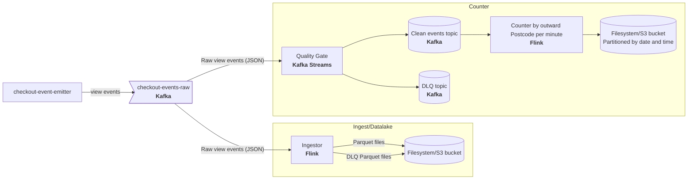

# Architecture diagram

```mermaid
flowchart LR
  Emitter["checkout-event-emitter"]
  KafkaRaw>"checkout-events-raw<br/><b>Kafka</b>"]

  Emitter -->|"view events"| KafkaRaw
  
  subgraph Ingest/Datalake
    Ingestor["Ingestor<br/><b>Flink</b>"]
    LakeRaw[("Filesystem/S3 bucket")]
  end
  
  KafkaRaw -->|"Raw view events (JSON)"| Ingestor
  Ingestor -->|"Parquet files"| LakeRaw
  Ingestor -->|"DLQ Parquet files"| LakeRaw

  subgraph Counter
    QG["Quality Gate<br/><b>Kafka Streams</b>"]
    CleanTopic[("Clean events topic<br/><b>Kafka</b>")]
    DLQ[("DLQ topic<br/><b>Kafka</b>")]
    Count["Counter by outward Postcode per minute<br/><b>Flink</b>"]
    LakeAgg[("Filesystem/S3 bucket</br>Partitioned by date and time")]
  end
  
  KafkaRaw -->|"Raw view events (JSON)"| QG
  QG --> DLQ
  QG --> CleanTopic

  CleanTopic --> Count
  Count --> LakeAgg
```

